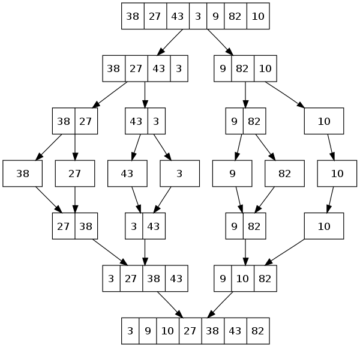

# Interview 01

Implement Mergesort.

## Specifications

- Read all of the following instructions carefully.
- Act as an interviewer, giving a candidate a code challenge
- Score the candidate according to the [Whiteboard Rubric](https://docs.google.com/spreadsheets/d/1scthkmARfzAFZrSYAp6LA2coOaoWUWbSzMbtIU4jcHw){:target="_blank"}
- You are free to offer suggestions or guidance (and see how they respond), but don't solve it for the candidate.

## Feature Tasks

- Ask the candidate to write a function to implement a mergesort.
- Avoid utilizing any of the built-in methods available in your language.
- Offer an example input array of positive and negative integers.
- Encourage a recursive solution, for elegance. Iterative solutions are possible.
- The candidate should have at least 2 functions—traditionally, a `mergesort` and a `merge` function.
- The candidate should be able to describe the properties of the algorithm they implement:
  - Is it in-place?
    - Most likely not.
  - Is it stable?
    - Most likely, depends on implementation.
  - Is it adaptable?
    - Most likely, depends on implementation.
  - What's the time and space complexity?
    - This is a divide-and-conquer algorithm, so it takes `O(n log n)` time—that's `n` steps to merge arrays, `log n` times.
    - Since at any given time, it only ever needs `n` elements stored in arrays to merge, it uses `O(n)` space.

## Structure

Familiarize yourself with the grading rubric, so you know how to score the interview.

Look for effective problem solving, efficient use of time, and effective communication with the whiteboard space available.

Every solution might look a little different, but the candidate should be able to test their solution with different inputs to verify correctness.

Assign points for each item on the Rubric, according to how well the candidate executed on that skill.

Add up all the points at the end, and record the total at the bottom of the page.

## Example

## Documentation

Record detailed notes on the rubric, to share with the candidate when the interview is complete.

## Solution

  
Merge Sort

  

    
Algorithm

     Merge sort uses a divide and conquer approach, using the middle index of an array as the starting point.  From the middle we split the array in two sub arrays, left and right, than we read values from the beginnings of both sub arrays.  We compare both values, and move the smaller value toward the front of the original.  We do this recursively until our sub arrays are too small and there are no more values to move.  This should sort the array in place. 
  

  

    
PseudoCode

    algorithm MERGESORT:
      declare array ARRAY <- input array

      if ARRAY length is greater than 1:
        declare number MID_INDEX <-- middle index value of ARRAY
        declare array LEFT <-- array values from 0 to MID_INDEX
        declare array RIGHT <-- array values from MID_INDEX to end of array

        call MERGESORT on left
        call MERGESORT on right
        call MERGE on LEFT, RIGHT, and ARRAY

    algorithm MERGE:
      declare array LEFT <- input array
      declare array RIGHT <- input array
      declare array FULL <- input array

      declare number I <-- starts at 0
      declare number J <-- starts at 0
      declare number K <-- starts at 0

      while I is less than the length of LEFT and J is less than the length of RIGHT:
        if the value of LEFT at I is less than or equal to the value of RIGHT at J:
          set the value of FULL at position K <- LEFT at position I
          increase I by 1
        else:
          set the value of FULL at position K <- RIGHT at position J
          increase J by 1

        increase K by 1

    if I is equal to the length of LEFT:
        set remaining entries in FULL to remaining values in RIGHT
    else:
        set remaining entries in FULL to remaining values in LEFT

  

  

    
Big O

     This solution has an 0(n * log(n)) growth rate of complexity.  We are running our iterative logic once on every value present in the array, but we are recursively calling our functions log(n) times as we divide our arrays in 2 before each recursive call. Space complexity grows at 0(n) since we need to split all values into sub arrays storing all values at the beginning of our loops. 
  

